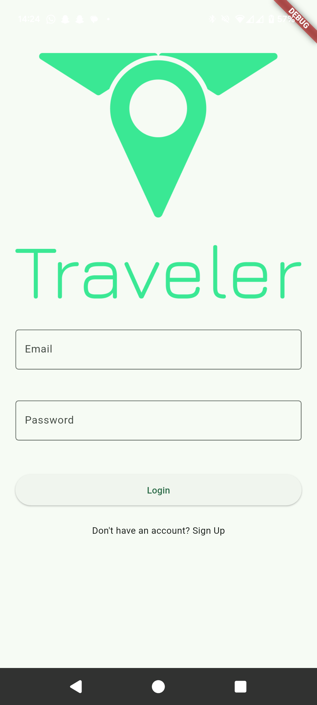
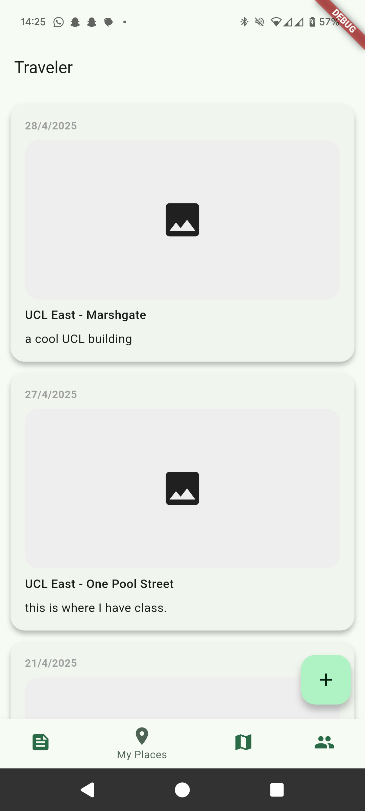
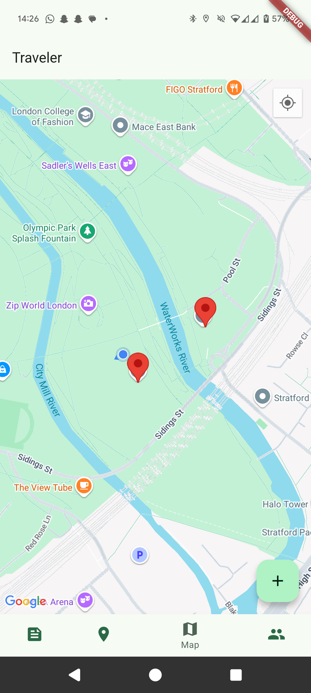
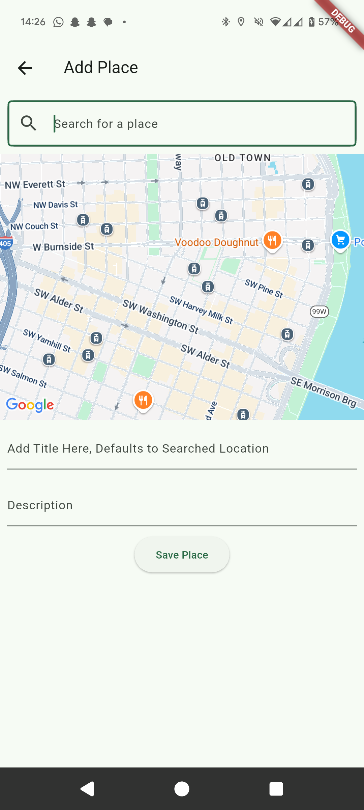
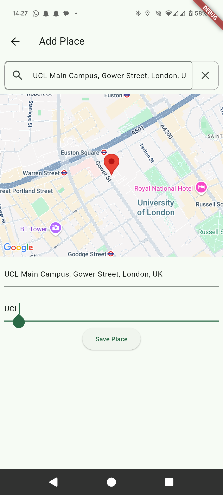

# Traveler

Traveler is your companion app for traveling. Whether it's within your hometown, or traveling to the other side of the world, Traveler allows you to save every place you would like to visit, and reminds you when you are nearby it! Simply save a place that you've been wanting to visit, and the next time you are in the area, Traveler will give you a notification to remind you to check it out!

## Table of Contents

- [How to Use](#how-to-use)
- [Design Journey](#design-journey)
- [Future Features](#future-features)
- [Installation](#installation)
- [Third Party APIs](#third-party-apis)
- [Packages](#packages)
- [Support](#support)
- [Appendix](#appendix)


## What is Traveler?

To the people who love to wander cities, but can't be bothered to be staring at Google Maps the entire time, this app is for you. I've built this app to be as simple to use as possible: simply click the :heavy_plus_sign: to add a new place, type in the location you would like to save, and it should appear in the drop down menu. After selecting it, you can provide a little description so you don't forget why you wanted to visit. Next time you are in the area of your saved location, you will get a quick notification reminding you to visit your saved place!

## Design Journey

### Lo-Fi Sketch
This app started as a quick sketch of how the user might save, and see more details about locations.


### Hi-Fi Sketch

From creating the lofi sketch, I went into figma and gave the sketch more details. This added more considerations for the app earlier in the design stage.

#### Login Flow


#### User Flow


#### Notification Flow


### App Screenshots

#### Login Page


#### My Places Page


#### Maps Page


#### Add Places Page
<div style="display: flex; gap: 10px;">
  
  
</div>

## Setup and Installation

### Backend Architecture


### How to Setup Backend

For this project I used Supabase to take care of my user authentication and backend. While there are other apps that also provide this functionality such as Firebase, I found Supabase to provide everything I needed, while also being open-source, and was free for the extents of this project. Supabase also provides an AI helper for creating endpoints. It works well enough, but after the initial edge function is created, I found it easier to go in and manually adjust the functions when changing the tables.

1. Create a [Supabase Account](https://supabase.com/)
2. Setup the [User Authetication](https://supabase.com/auth) through Supabase
3. Create 3 tables. 

    *Note: The User Auth table provides the user_id foreign key*

    #### Locations
    | place_id | user_id | gmaps_id | latLng | title | info |
    |----------|---------|----------|--------|-------|------|
    | primary-key | foreign-key | String from GMaps | [##.##, ##.##] | "Place Name" | "Some Discriptor" |

    #### Users_to_Locations
    | uuid | user_id | place_id |
    |------|---------|----------|
    | primary-key | foreign-key | foreign-key |

    #### Users_to_Friends
    | uuid | user_id | friend_id |
    |------|---------|-----------|
    | primary-key | foreign-key | foreign-key |

4. Setup the Edge functions

    #### /add_location

    ```
    import "jsr:@supabase/functions-js/edge-runtime.d.ts";
    import { createClient } from "jsr:@supabase/supabase-js";
    Deno.serve(async (req)=>{
    if (req.method === 'OPTIONS') {
        return new Response('ok', {
        status: 200
        });
    }
    const { user_id, gmaps_id, info, latLng, title } = await req.json();
    // Validate latLng input
    if (!Array.isArray(latLng) || latLng.length !== 2) {
        return new Response(JSON.stringify({
        error: 'latLng must be an array of exactly two floats.'
        }), {
        headers: {
            'Content-Type': 'application/json'
        },
        status: 400
        });
    }
    const supabaseClient = createClient(Deno.env.get('SUPABASE_URL'), Deno.env.get('SUPABASE_SERVICE_ROLE_KEY'));
    // Insert into locations table
    const { data: locationData, error: locationError } = await supabaseClient.from('locations').insert([
        {
        gmaps_id: gmaps_id,
        info: info,
        created_at: new Date().toISOString(),
        latLng: latLng,
        title: title // New title column
        }
    ]).select('place_id').single();
    if (locationError) {
        return new Response(JSON.stringify({
        error: locationError.message
        }), {
        headers: {
            'Content-Type': 'application/json'
        },
        status: 400
        });
    }
    const place_id = locationData.place_id;
    // Insert into users_to_locations table
    const { error: userLocationError } = await supabaseClient.from('users_to_locations').insert([
        {
        user_id: user_id,
        place_id: place_id
        }
    ]);
    if (userLocationError) {
        return new Response(JSON.stringify({
        error: userLocationError.message
        }), {
        headers: {
            'Content-Type': 'application/json'
        },
        status: 400
        });
    }
    return new Response(JSON.stringify({
        message: 'Location added successfully'
    }), {
        headers: {
        'Content-Type': 'application/json'
        },
        status: 200
    });
    });

    ```

    #### /get_locations

    ```
    import "jsr:@supabase/functions-js/edge-runtime.d.ts";
    import { createClient } from "jsr:@supabase/supabase-js";
    Deno.serve(async (req)=>{
    if (req.method === 'OPTIONS') {
        return new Response('ok', {
        status: 200
        });
    }
    const { user_id } = await req.json();
    const supabaseClient = createClient(Deno.env.get('SUPABASE_URL'), Deno.env.get('SUPABASE_SERVICE_ROLE_KEY'));
    // Fetch place_ids for the user
    const { data: userLocations, error: userLocationError } = await supabaseClient.from('users_to_locations').select('place_id').eq('user_id', user_id);
    if (userLocationError) {
        return new Response(JSON.stringify({
        error: userLocationError.message
        }), {
        headers: {
            'Content-Type': 'application/json'
        },
        status: 400
        });
    }
    const placeIds = userLocations.map((location)=>location.place_id);
    // Fetch user locations including created_at
    const { data, error } = await supabaseClient.from('locations').select('title, latLng, place_id').in('place_id', placeIds);
    if (error) {
        return new Response(JSON.stringify({
        error: error.message
        }), {
        headers: {
            'Content-Type': 'application/json'
        },
        status: 400
        });
    }
    return new Response(JSON.stringify(data), {
        headers: {
        'Content-Type': 'application/json'
        },
        status: 200
    });
    });

    ```

    #### /get-saved-places

    ```
    import "jsr:@supabase/functions-js/edge-runtime.d.ts";
    import { createClient } from "jsr:@supabase/supabase-js";
    Deno.serve(async (req)=>{
    if (req.method === 'OPTIONS') {
        return new Response('ok', {
        status: 200
        });
    }
    const { user_id } = await req.json();
    const supabaseClient = createClient(Deno.env.get('SUPABASE_URL'), Deno.env.get('SUPABASE_SERVICE_ROLE_KEY'));
    // Fetch place_ids for the user
    const { data: userLocations, error: userLocationError } = await supabaseClient.from('users_to_locations').select('place_id').eq('user_id', user_id);
    if (userLocationError) {
        return new Response(JSON.stringify({
        error: userLocationError.message
        }), {
        headers: {
            'Content-Type': 'application/json'
        },
        status: 400
        });
    }
    const placeIds = userLocations.map((location)=>location.place_id);
    // Fetch user locations including created_at
    const { data, error } = await supabaseClient.from('locations').select('place_id, title, info, created_at').in('place_id', placeIds);
    if (error) {
        return new Response(JSON.stringify({
        error: error.message
        }), {
        headers: {
            'Content-Type': 'application/json'
        },
        status: 400
        });
    }
    return new Response(JSON.stringify(data), {
        headers: {
        'Content-Type': 'application/json'
        },
        status: 200
    });
    });

    ```

### Initializing the Application

1. Clone repo locally
2. Create a `.env` file in the project directory
    ```
    MAPS_API_KEY=<Pull this from your Google Maps API>
    SUPABASE_URL=<Pull this from Supabase>
    SUPABASE_KEY=<Pull this from Supabase>
    ```
3. Verify `Flutter` and `Dart` versions
    | Flutter | Dart |
    |---------|------|
    | 3.29.2  | 3.7.2|
4. Run `flutter pub get`. This will pull all the packages required for the project.
5. Run `flutter build apk`

> Note: `flutter clean` can help with clean builds.

## Third Party APIs

The three third party APIs that were used heavily for this project were Google Maps, Google Places, and Supabase.
Google Maps and Google Places are used for all the map pages. Using this is how the distance between the user and the location is determined. Supabase takes care of all backend parts, from User Auth to database tables, and API functions.

## Packages

- [flutter_launch_icons](https://pub.dev/packages/flutter_launcher_icons)
- [flutter_native_splash](https://pub.dev/packages/flutter_native_splash)
- [go_router](https://pub.dev/packages/go_router)
- [google_maps_flutter](https://pub.dev/packages/google_maps_flutter)
- [http](https://pub.dev/packages/http)
- [json_annotation](https://pub.dev/packages/json_annotation)
- [json_serializable](https://pub.dev/packages/json_serializable)
- [flutter_secure_storage](https://pub.dev/packages/flutter_secure_storage)
- [google_places_flutter](https://pub.dev/packages/google_places_flutter)
- [geocoding](https://pub.dev/packages/geocoding)
- [geolocator](https://pub.dev/packages/geolocator)
- [flutter_dotenv](https://pub.dev/packages/flutter_dotenv)
- [supabase_flutter](https://pub.dev/packages/supabase_flutter)
- [background_fetch](https://pub.dev/packages/background_fetch)
- [flutter_local_notifications](https://pub.dev/packages/flutter_local_notifications)

## Future Features

- Complete the Feed page
- Link friends to the main user
- Create a profile page
- Clicking a saved place in `My Places` opens a page that provides users with more information about their saved spot, as well as allows them to edit the place.
- Populate the Map page with User's saved locations.
- Populate the Map page with User's friend's saved locations (different color)
- Add a Filter function to the maps page to see only certain friends.
- Add a username/first and last name to the user's database.
- Figure out map cacheing to improve app load times.
- Link feed page cards with the additional information about the specific location's details.
- Link notification pop-up to a page about the unique place, and add a Google Maps/Apple Maps link.
- Add search feature to friends page to find friends.
- Add images to the app
- Manually drop a marker when saving a new location, either in the main mapp, or on the add places map.

## Support

<a href="https://github.com/vineethk96" style="display: flex; align-items: center; text-decoration: none;">
  
  <span style="font-size: 1.2em; color: white;">@vineethk96</span>
</a>

## Appendix

1. (19) Flutter Google Maps API Tutorial | Markers, Polylines, & Directions API - YouTube [WWW Document], n.d. URL https://www.youtube.com/watch?v=Zz5hMvgiWmY&t=2s&ab_channel=MarcusNg (accessed 4.29.25).

2. ChatGPT [WWW Document], n.d. URL https://chatgpt.com (accessed 4.29.25).

3. Getting Started with Supabase & Flutter, 2024. URL https://www.youtube.com/watch?v=NbZ3OslauRw&ab_channel=MitchKoko

4. How to Make an App for Beginners - 2025 Roadmap, 2025. URL https://www.youtube.com/watch?v=KiLdMEtZdBQ

5. Supabase, 2025. Use Supabase with Flutter | Supabase Docs [WWW Document]. URL https://supabase.com/docs/guides/getting-started/quickstarts/flutter (accessed 4.29.25).

6. The official repository for Dart and Flutter packages. [WWW Document], n.d. . Dart packages. URL https://pub.dev/ (accessed 4.29.25).